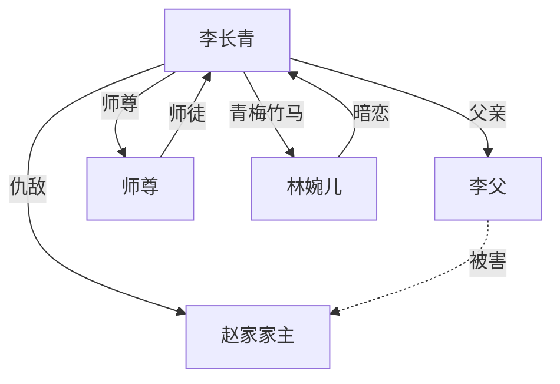
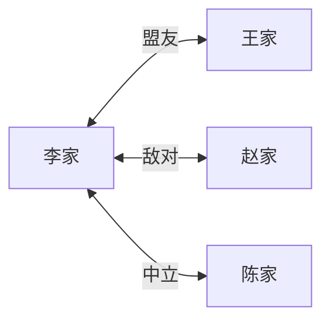

# 人物关系图文档模板

本模板定义了人物关系追踪文档的标准格式，用于记录和管理小说中所有角色之间的关系及变化。

---

## 文档命名
`character-relationships.md`

## 文档作用

### 核心价值
- **快速查询**：快速了解任何两个角色之间的关系状态
- **变化追踪**：记录关系的变化轨迹和时间点
- **避免矛盾**：防止人物关系前后不一致
- **辅助创作**：写作时快速查询角色关系，避免遗忘

### 适用场景
- 每次创作前，必须读取此文档
- 人物关系发生变化时，必须立即更新
- 定期检查人物关系的一致性

---

## 文档格式模板

```markdown
# 人物关系图

**最后更新**: YYYY-MM-DD HH:MM:SS
**更新章节**: 第X章
**总角色数**: X人

---

## 一、关系矩阵

### 关系说明
| 关系类型 | 代码 | 说明 |
|---------|------|------|
| 亲属 | F | 父母、子女、兄弟姐妹 |
| 师徒 | M | 师父、弟子、师门 |
| 主仆 | S | 主人、下属、仆从 |
| 朋友 | FR | 朋友、闺蜜、兄弟 |
| 敌对 | E | 对手、仇人、敌对势力 |
| 暧昧 | A | 恋爱中、暧昧期 |
| 情侣 | L | 已确定关系 |
| 前任 | EX | 前任恋人 |
| 仰慕 | CR | 单恋、暗恋 |
| 救命 | SV | 有救命之恩 |
| 欠债 | DB | 欠人情、债务 |
| 其他 | O | 其他关系 |

### 当前关系矩阵
| 角色A | 角色B | 关系类型 | 状态 | 变化章节 | 备注 |
|------|------|----------|------|----------|------|
| 李长青 | 李父 | F | 亲厚 | - | 亲生父子 |
| 李长青 | 赵家主 | E | 敌对 | 第5章 | 杀父之仇 |
| 李长青 | 师尊 | M | 尊敬 | 第10章 | 师徒关系 |
| ... | ... | ... | ... | ... | ... |

---

## 二、主要人物关系网络

### 主角阵营

#### 主角：[角色名]
**当前关系网络**：
```
[角色A] ←── 亲属 ──→ [角色B]
   ↓                    ↓
[角色C] ←── 师徒 ──→ [角色D]
   ↓
[角色E] ←── 敌对 ──→ [角色F]
```

**关系详细说明**：

**与[角色A]的关系**：
- **关系类型**：亲属（父子）
- **当前状态**：亲厚
- **关系描述**：主角视父亲为生命中最重要的人，父亲也疼爱主角
- **变化轨迹**：一直亲厚，未发生重大变化

**与[角色B]的关系**：
- **关系类型**：敌对（杀父之仇）
- **当前状态**：敌对
- **关系描述**：赵家主害死了主角父亲，主角决心复仇
- **变化轨迹**：
  - 第1章：主角发现真相，由尊敬转为仇恨
  - 第5章：主角表面隐忍，内心已将赵家主列为必杀目标
  - 第X章：[后续变化待定]

**与[角色C]的关系**：
- **关系类型**：师徒
- **当前状态**：尊敬
- **关系描述**：[描述]
- **变化轨迹**：[描述]

---

### 反派阵营

#### 反派首领：[角色名]
**当前关系网络**：
```
[角色A] ←── 主上 ──→ [角色B]
   ↓
[角色C] ←── 同盟 ──→ [角色D]
```

**关系详细说明**：
[同上格式]

---

## 三、按角色索引的关系列表

### 主角：[角色名]
**相关角色**（按关系亲疏排序）：
1. **[角色A]** - 父亲，F，亲厚
2. **[角色B]** - 师尊，M，尊敬
3. **[角色C]** - 青梅竹马，FR，喜欢
4. **[角色D]** - 杀父仇人，E，敌对
5. **[角色E]** - [关系描述]
...

### 角色：[角色名]
**相关角色**：
1. **[角色A]** - [关系]
2. **[角色B]** - [关系]
...

---

## 四、关系变化时间线

### 第X章：关系变化记录
**变化事件**：[角色A]与[角色B]的关系由[原来]变为[现在]

**变化原因**：[具体情节描述]

**影响范围**：
- 对角色A的影响：[描述]
- 对角色B的影响：[描述]
- 对其他角色的影响：[描述]

**伏笔暗示**：[是否有后续伏笔]

---

## 五、重要关系详细说明

### 关系1：[主角与父亲]
**当前状态**：亲厚、依赖

**关系发展**：
- **起**（第1章）：主角自幼丧母，与父亲相依为命
- **承**（第10章）：父亲为保护主角受重伤，主角悲痛欲绝
- **转**（第30章）：[转折点]
- **合**（第X章）：[最终状态]

**关系特点**：
- 父子情深，父亲愿意为儿子付出一切
- 主角孝顺父亲，是父亲的骄傲
- 这是主角最珍视的关系

**重要性**：⭐⭐⭐⭐⭐
**影响**：父亲的存在是主角成长的动力和底线

---

### 关系2：[主角与杀父仇人]
**当前状态**：敌对、不死不休

**关系发展**：
- **起**（第1章）：主角发现父亲死亡的真相
- **承**（第10-30章）：主角表面隐忍，暗中积蓄力量
- **转**（第X章）：[转折点]
- **合**（第X章）：[最终状态]

**关系特点**：
- 表面：主角装作不知道，维持表面和平
- 内心：刻骨铭心的仇恨，复仇是核心驱动力
- 行动：主角在等待时机，一击必杀

**重要性**：⭐⭐⭐⭐⭐
**影响**：这是推动主线剧情的核心冲突

---

## 六、特殊关系

### 情感关系
**当前情感线**：
- [角色A] ↔ [角色B]：暧昧期，未确定关系
- [角色C] → [角色D]：单恋，[角色D]不知情
- [角色E] ↔ [角色F]：情侣关系

### 复杂关系
**多角关系**：
- [角色A]、[角色B]、[角色C]：三角关系
  - A喜欢B，B喜欢C，C喜欢A
  - 当前状态：[描述]
  - 预期发展：[描述]

**隐藏关系**：
- [角色A] 是 [角色B] 的私生子（仅读者知道，角色不知）
- [角色C] 背叛了 [角色D]，但 [角色D] 还不知道
- [角色E] 是 [角色F] 的杀父仇人，但 [角色F] 误以为 [角色E] 是恩人

---

## 七、势力/阵营关系

### 势力格局
```
[李家] ◄─┬─► [赵家]（敌对）
          │
          ├─► [王家]（盟友）
          │
          └─► [陈家]（中立）
```

### 势力间关系
- **李家 vs 赵家**：敌对，争夺资源
- **李家 vs 王家**：盟友，联姻结盟
- **李家 vs 陈家**：中立，互不侵犯

### 势力内部关系
- **李家**：[大房 vs 旁系的斗争]
- **赵家**：[描述]

---

## 八、关系图可视化（Mermaid格式）

### 主角关系图


### 势力关系图


---

## 九、更新记录

| 更新时间 | 更新章节 | 更新内容 | 更新人 |
|---------|---------|---------|--------|
| 2025-01-28 | 第1章 | 创建人物关系图 | AI |
| 2025-01-28 | 第5章 | 李长青发现赵家是杀父仇人，关系转为敌对 | AI |
| 2025-01-28 | 第10章 | 李长青拜师，新增师徒关系 | AI |

---

## 十、一致性检查清单

每次创作前，使用此清单检查：

- [ ] 本章出场角色的关系是否与文档一致？
- [ ] 本章是否有新的关系变化？
- [ ] 本章是否影响了已有的关系？
- [ ] 关系变化是否已记录到"关系变化时间线"？
- [ ] 关系矩阵是否已更新？
- [ ] 是否需要更新关系图可视化？

---

**备注**：
- 本文档是长篇创作中防止人物关系混乱的核心文档
- 每次创作前必须读取，创作后如有变化必须立即更新
- 建议每5-10章进行一次全面检查，确保人物关系的一致性
- 使用Mermaid图表可以直观展示复杂关系网络
